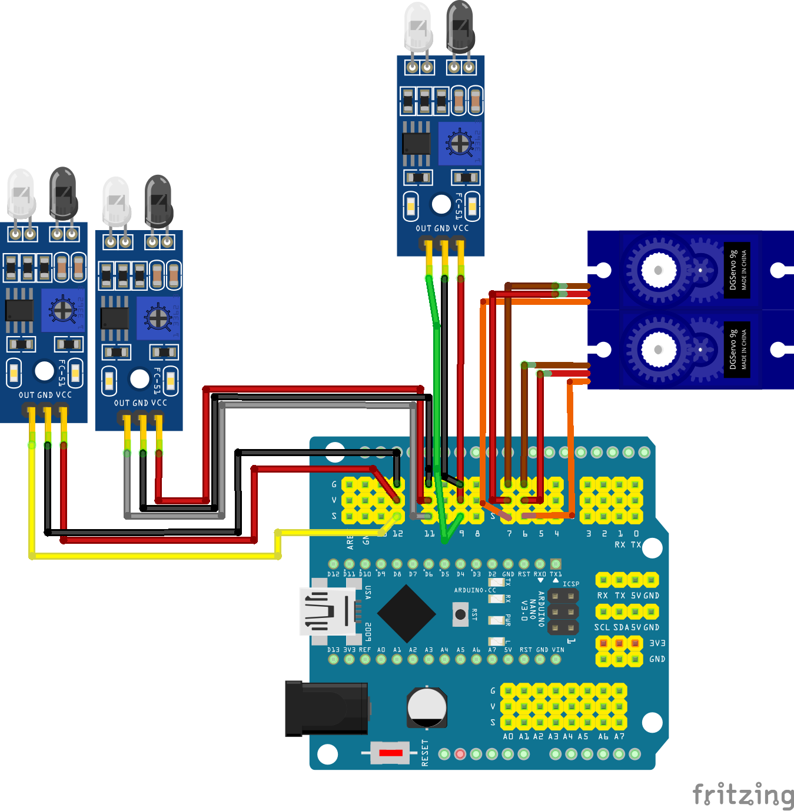

# Robô Incredible Jaban

## Características

Robô seguidor de linha com detecção de obstáculo e meia-volta.

- As linhas debem ser pretas, contrastando com a cor branca.
- Código compatível com o Arduino

## Esquema elétrico

